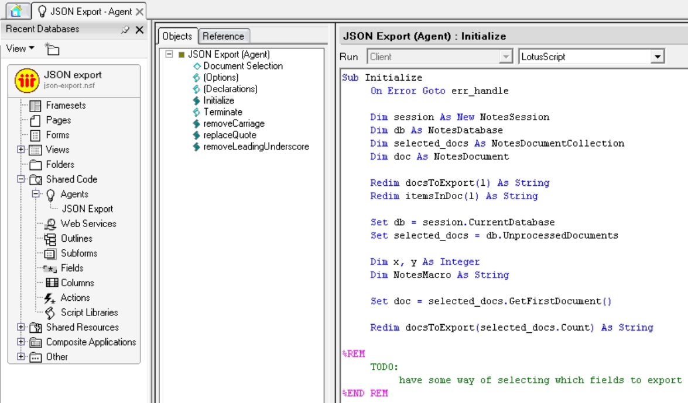
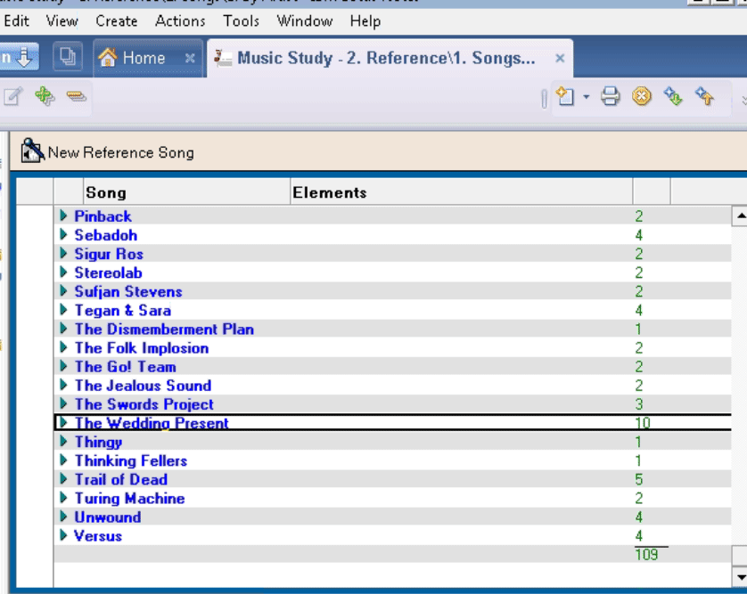

# Lotus Notes JSON Exporter
A simple (work in progress) LotusScript agent to export Lotus Notes documents to JSON files.

## Usage

1. Create an agent in your Notes db; e.g., `JSON Export`.

2. Copy the code from the files in the `agent` directory into the `Initialize` and each Function. The result should look something like:

3. From a view, select the documents you wish to export, then select `Actions / JSON Export` as shown below. (Note: it might be a good idea to export different document types--i.e., documents created with different Forms--to separate files.)

### Known Issues:

- Does not yet export rich text fields or attachments.
- Tabs and other special characters may cause some issues.